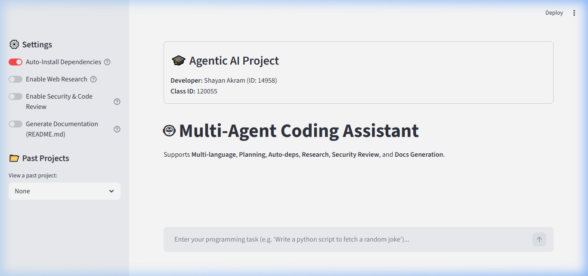

# 🤖 Multi-Agent Coding Assistant

A powerful, state-of-the-art Multi-Agent Coding Assistant that supports multi-language execution, architectural planning, automatic dependency resolution, code security/vulnerability scanning, web research, and comprehensive documentation generation. Powered by advanced LLMs (via Ollama).

Designed and developed by **Shayan Akram**.

---

## 🖥️ User Interface Preview

Here is a preview of the web application built using Streamlit:



---

## 🌟 Key Features

- **📝 Architecture Planning**: The assistant maps out complex file structures and execution steps before writing any code.
- **🌐 Web Research**: Seamlessly integrates DuckDuckGo search to query modern APIs and documentation for more accurate code generation.
- **💻 Multi-Language Support**: Generates, tests, and refactors code in Python, C++, and more.
- **🛡️ Security & Code Review**: A designated security agent inspects code for vulnerabilities and refactors it automatically.
- **📦 Auto-Dependency Resolution**: Detects import errors during trial runs and automatically runs installations to fix environments.
- **🧪 Self-Correction (Fix Loop)**: Tests code iteratively and feeds execution errors back to a dedicated Fix Agent to self-heal.
- **📂 Past Projects Archive**: Downloads complete versions of historical projects as ZIP archives directly from the Streamlit UI.

---

## 🚀 Getting Started

### Prerequisites

1. **Python 3.10+**
2. **Ollama** (for running local LLMs, e.g., `mistral` or `llama3`)

### Installation

1. Clone this repository:
   ```bash
   git clone https://github.com/SHAYANkhanzada/Multi-Agent-Coding-Assistant.git
   cd Multi-Agent-Coding-Assistant
   ```

2. Install python dependencies:
   ```bash
   pip install -r requirements.txt
   ```

3. Configure your environment variables in `.env` (optional, defaults provided):
   ```env
   OLLAMA_API_URL=http://localhost:11434/api/generate
   MODEL_NAME=mistral
   ```

4. Make sure Ollama is running and has your preferred model pulled:
   ```bash
   ollama run mistral
   ```

---

## 🖥️ Running the Application

### 1. Web Application (Streamlit)
To launch the rich, interactive graphical interface:
```bash
streamlit run app.py
```

### 2. Command Line Interface
To run via a lightweight CLI shell:
```bash
python main.py
```

---

## ⚙️ Architecture & Agents

- **Planner Agent (`agents.py`)**: Breaks down prompts into distinct planning steps and modular file lists.
- **Code Agent (`agents.py`)**: Produces syntax-highlighted code matching the planner's layout.
- **Security & Review Agent (`agents.py`)**: Reviews generated code for bugs, logic errors, and security issues.
- **Test Agent (`agents.py`)**: Executes generated scripts in a sandbox environment and records exit codes and outputs.
- **Dependency Agent (`agents.py`)**: Scans console output for missing libraries and pip-installs them instantly.
- **Fix Agent (`agents.py`)**: Leverages execution feedback to revise faulty lines of code.

---

## 📄 License

This project is licensed under the MIT License.
